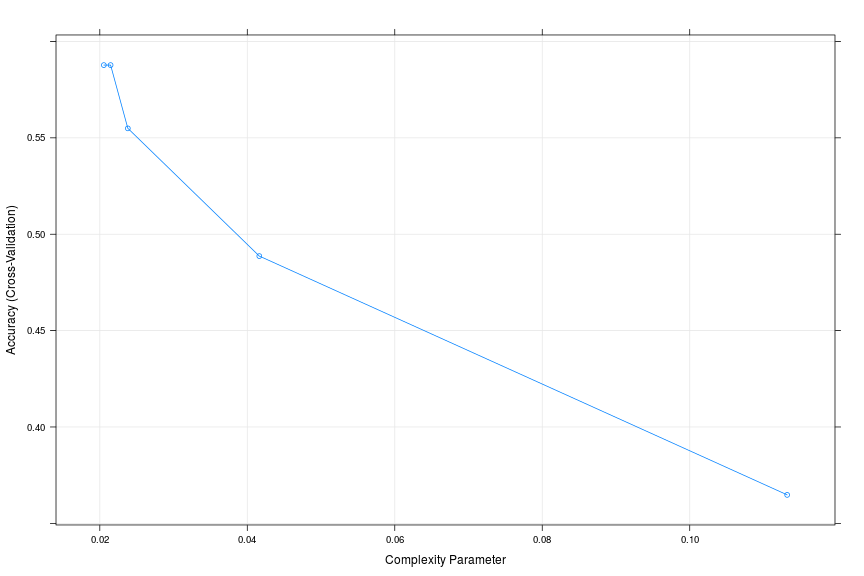

https://github.com/dmaust/DataScience-ML-Project
https://github.com/SweeRoty/pml/blob/master/project.md

Do it correctly
========================================================


#Exec summary


## Exploration of data

### Getting the data
The data are aquired from: https://d396qusza40orc.cloudfront.net/predmachlearn/pml-training.csv (training set) and from https://d396qusza40orc.cloudfront.net/predmachlearn/pml-testing.csv (testing set). Data are described here: http://groupware.les.inf.puc-rio.br/har


```r
library(ggplot2);
library(caret);

if (file.exists("pml-training.rds")) {
    pml_training<-readRDS("pml-training.rds");
} else {
    download.file("https://d396qusza40orc.cloudfront.net/predmachlearn/pml-training.csv", destfile="pml-training.csv", method="curl");
    pml_training<-read.csv("pml-training.csv", stringsAsFactors=FALSE, na.strings = c("NA", "#DIV/0!"));
    saveRDS(pml_training, file="pml-training.rds");
}

if (file.exists("pml-testing.rds")) {
    pml_testing<-readRDS("pml-testing.rds");
} else {
    download.file("https://d396qusza40orc.cloudfront.net/predmachlearn/pml-testing.csv", destfile="pml-testing.csv", method="curl");
    pml_testing<-read.csv("pml-testing.csv", stringsAsFactors=FALSE, na.strings = c("NA", "#DIV/0!"));
    saveRDS(pml_testing, file="pml-testing.rds");
}
```
### Removal of not predicitve data


```r
set.seed(8888)
trainingIndex <- createDataPartition(pml_training$classe, list=FALSE, p=.7)
training = pml_training[trainingIndex,]
testing = pml_training[-trainingIndex,]
```

Remove indicators with near zero variance. Those variables will not have a great impact on generated model.


```r
nzv <- nearZeroVar(training)

training <- training[-nzv]
testing <- testing[-nzv]
pml_testing <- pml_testing[-nzv]
```

Then we calculate which columns are numeric (since only those can be processed by algorithms)

```r
num_features_idx = which(lapply(training,class) %in% c('numeric')  )
```

We fill missing values based od model from `knnImpute` method from `preProcess` function.

```r
preModel <- preProcess(training[,num_features_idx], method=c('knnImpute'))

p_training <- cbind(training$classe, predict(preModel, training[,num_features_idx]))
p_testing <- cbind(testing$classe, predict(preModel, testing[,num_features_idx]))
pr_testing <- predict(preModel, pml_testing[,num_features_idx])

#Fixing names
names(p_training)[1] <- 'classe'
names(p_testing)[1] <- 'classe'
```

### Classification
Six young health participants were asked to perform one set of 10 repetitions of the Unilateral Dumbbell Biceps Curl in five different fashions: exactly according to the specification (Class A), throwing the elbows to the front (Class B), lifting the dumbbell only halfway (Class C), lowering the dumbbell only halfway (Class D) and throwing the hips to the front (Class E).

Read more: http://groupware.les.inf.puc-rio.br/har#weight_lifting_exercises#ixzz38Q6Fxj5v


```r
cvControl <- trainControl(method = "cv", number = 5)
treefit <- train(classe ~ ., trControl = cvControl, method = "rpart", tuneLength = 5, data=p_training);

plot(treefit)
```

 

```r
# Due to time constraints, result of processing random forest with crossValidation are skipped, final result
# comes to model randomForest(classe ~ ., mtry=46, n=500)
if (file.exists("rForest.RData")) {
    load("rForest.RData")
} else {
    rForest <- train(classe ~ ., trControl = cvControl, method = "rf", tuneLength = 5, data=p_training);
    save(rForest, file="rForest.RData")
}
plot(rForest)
```

 

From the two plots, we can see that, using 5-fold cross validation, the estimated out of sample error rate of the Tree model is above 40%, while that of the Random Forest model is less than 1%. So we choose the best Random Forest model as our final model and apply it to our generated testing data to see how well it generalizes.

### Final model


```r
# model <- rForest$finalModel
library(randomForest)
model  <- randomForest(classe ~ ., p_training, ntree=500, mtry=46)
summary(model)
```

```
##                 Length Class  Mode     
## call                5  -none- call     
## type                1  -none- character
## predicted       13737  factor numeric  
## err.rate         3000  -none- numeric  
## confusion          30  -none- numeric  
## votes           68685  matrix numeric  
## oob.times       13737  -none- numeric  
## classes             5  -none- character
## importance         90  -none- numeric  
## importanceSD        0  -none- NULL     
## localImportance     0  -none- NULL     
## proximity           0  -none- NULL     
## ntree               1  -none- numeric  
## mtry                1  -none- numeric  
## forest             14  -none- list     
## y               13737  factor numeric  
## test                0  -none- NULL     
## inbag               0  -none- NULL     
## terms               3  terms  call
```

# Cross Validation
To measure the accuracy  training set and our cross validation set will be used. With the training set we can detect if our model has bias due to ridgity of model. With the cross validation set, determination if of variance due to overfitting can be detected.

##In-sample accuracy

```r
pred.train <- predict(model, newdata = p_training)
confusionMatrix(pred.train, p_training$classe)
```

```
## Confusion Matrix and Statistics
## 
##           Reference
## Prediction    A    B    C    D    E
##          A 3906    0    0    0    0
##          B    0 2658    0    0    0
##          C    0    0 2396    0    0
##          D    0    0    0 2252    0
##          E    0    0    0    0 2525
## 
## Overall Statistics
##                                 
##                Accuracy : 1     
##                  95% CI : (1, 1)
##     No Information Rate : 0.284 
##     P-Value [Acc > NIR] : <2e-16
##                                 
##                   Kappa : 1     
##  Mcnemar's Test P-Value : NA    
## 
## Statistics by Class:
## 
##                      Class: A Class: B Class: C Class: D Class: E
## Sensitivity             1.000    1.000    1.000    1.000    1.000
## Specificity             1.000    1.000    1.000    1.000    1.000
## Pos Pred Value          1.000    1.000    1.000    1.000    1.000
## Neg Pred Value          1.000    1.000    1.000    1.000    1.000
## Prevalence              0.284    0.193    0.174    0.164    0.184
## Detection Rate          0.284    0.193    0.174    0.164    0.184
## Detection Prevalence    0.284    0.193    0.174    0.164    0.184
## Balanced Accuracy       1.000    1.000    1.000    1.000    1.000
```
The in sample accuracy is 100% which indicates, the model does not suffer from bias.

## Out-of-sample accuracy

```r
pred.test <- predict(model, newdata = p_testing)
confusionMatrix(pred.test, p_testing$classe)
```

```
## Confusion Matrix and Statistics
## 
##           Reference
## Prediction    A    B    C    D    E
##          A 1669   11    0    0    0
##          B    3 1121   12    0    2
##          C    1    7 1010    5    3
##          D    1    0    4  956    1
##          E    0    0    0    3 1076
## 
## Overall Statistics
##                                         
##                Accuracy : 0.991         
##                  95% CI : (0.988, 0.993)
##     No Information Rate : 0.284         
##     P-Value [Acc > NIR] : <2e-16        
##                                         
##                   Kappa : 0.989         
##  Mcnemar's Test P-Value : NA            
## 
## Statistics by Class:
## 
##                      Class: A Class: B Class: C Class: D Class: E
## Sensitivity             0.997    0.984    0.984    0.992    0.994
## Specificity             0.997    0.996    0.997    0.999    0.999
## Pos Pred Value          0.993    0.985    0.984    0.994    0.997
## Neg Pred Value          0.999    0.996    0.997    0.998    0.999
## Prevalence              0.284    0.194    0.174    0.164    0.184
## Detection Rate          0.284    0.190    0.172    0.162    0.183
## Detection Prevalence    0.285    0.193    0.174    0.163    0.183
## Balanced Accuracy       0.997    0.990    0.991    0.995    0.997
```
The cross validation accuracy is greater than 99%, which should be sufficient for predicting the twenty test observations. Based on the lower bound of the confidence interval we would expect to achieve a 98.7% classification accuracy on new data provided.


## Answers to final testing model

```r
answers <- predict(model, pr_testing) 
print(answers)
```

```
##  1  2  3  4  5  6  7  8  9 10 11 12 13 14 15 16 17 18 19 20 
##  B  A  B  A  A  E  D  B  A  A  B  C  B  A  E  E  A  B  B  B 
## Levels: A B C D E
```

